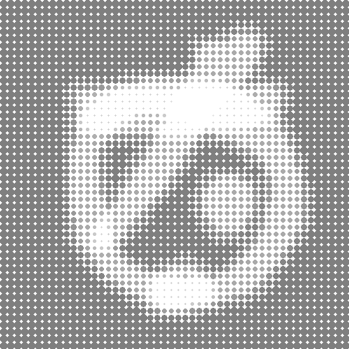

# Tensormage Image Processing Scripts

This repository contains a collection of Python scripts designed for advanced image processing and GIF creation. Each script implements a different method of manipulating and generating animations from a set of images. Below is a general overview of the functionality of these scripts, along with hints about their unique aspects.



## General Functionality

### Image Loading and Processing
All scripts include a class named `ImageProcessor` that handles the following tasks:

1. **Loading Images**: The `load_images_from_folder` method loads images from a specified folder, normalizing them to ensure consistent processing. The images are resized to a target shape, making them suitable for further manipulation.

2. **GIF Creation**: Each script is capable of generating a series of frames based on the input images and then compiling these frames into an animated GIF. The methods for frame generation differ across scripts, creating various visual effects.

3. **Saving GIFs**: The `save_gif` method saves the generated frames as a GIF file. The duration of each frame can be customized, allowing control over the speed of the animation.

### Key Differences

Although the scripts share a common structure, they differ in the specific techniques used to generate the frames for the GIFs:

1. **tensormage10.py**:
   - **Pixel Density and Mandelbrot Fractals**: This script introduces a unique approach by calculating pixel density for image regions and combining this with dynamically generated Mandelbrot fractal patterns. The frames are created based on these densities, resulting in complex and visually engaging animations that vary in intensity and structure.
  
2. **tensormage11.py**:
   - **Image Morphing**: This script focuses on smoothly morphing between images. It generates frames by blending pairs of images based on a linear interpolation, creating a fluid transition from one image to the next. This technique is well-suited for animations where a smooth evolution of shapes and colors is desired.

3. **tensormage12.py**:
   - **Forward and Reverse Morphing**: Building on the basic morphing technique, this script adds a reverse morphing phase to the animation. After completing the forward morph, the sequence is played in reverse, giving the appearance of a continuous loop without abrupt changes, making it ideal for seamless looping animations.

4. **tensormage13.py**:
   - **Looping Morphing with Additional Frames**: This script enhances the looping animation by carefully constructing additional frames to ensure a smooth transition when the animation loops. It extends the forward-reverse approach by refining the frame generation process, ensuring a more natural and visually appealing loop.

## Usage

Each script can be run independently by executing it in a Python environment. Ensure that the required libraries (`tensorflow`, `numpy`, `PIL`, `matplotlib`, etc.) are installed. Modify the `image_shape` and `folder_path` parameters according to your dataset and desired output.

```bash
python tensormageXX.py